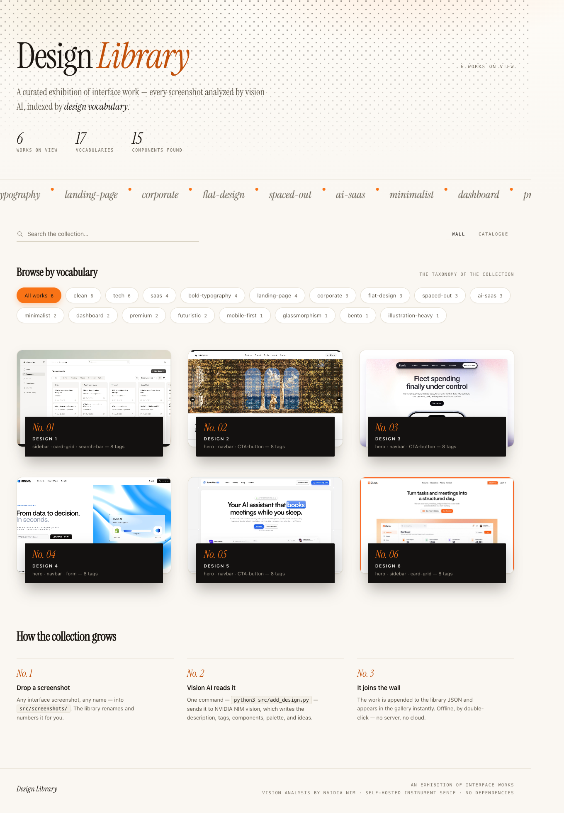

# Picasso — your personal design-inspiration library

Drop screenshots into a folder, run one command, and Picasso turns them into a
beautiful, searchable design gallery — every screenshot analyzed by a vision
model for its style, components, palette, and ideas. Browse it like a museum:
hover to focus, click to enter the viewing room, filter by design vocabulary.



## How it works

1. **You point Picasso at your screenshots folder** — during setup you paste any path
   (e.g. `~/Desktop/shots`); your images stay where they are, nothing is copied
2. **You run** `picasso update`
3. **Picasso scans only the new ones** — content-hash dedup means re-runs are instant,
   renames keep their analysis, and replaced files are detected and re-analyzed
4. **A vision model writes the library** — `data/library.json` with a full curator read per
   screenshot: description, layout structure, hero analysis, components, palette (with hex),
   typography, design-jargon tags, **use cases** ("use for a…"), and creative ideas
5. **Your gallery opens in the browser** — double-click `src/index.html` anytime,
   works fully offline (fonts bundled, no server needed)

## Quick start

```bash
# 1. Get the code
git clone <this-repo-url> && cd picasso

# 2. Install the `picasso` command (symlinks into ~/.local/bin)
./install.sh

# 3. One-time setup: pick a provider, paste your API key, pick a model,
#    and paste the path of your screenshots folder
picasso setup

# 4. Point Picasso at your screenshots (any .png / .jpg / .jpeg / .webp):
picasso update
```

The first `picasso` run creates its own Python virtual environment (`.venv`) —
no manual Python setup.

## Providers

Pick any one at `picasso setup` — the CLI remembers it.

| Provider | Models | Key | Free tier? |
|---|---|---|---|
| **OpenAI** | `gpt-5.6-sol`, `gpt-5.6-terra`, `gpt-5.6-luna`, `gpt-5.5`, `gpt-5.5-pro`, `gpt-5.4`, `gpt-5.4-pro`, `gpt-5.4-mini`, `gpt-5.4-nano` | [platform.openai.com/api-keys](https://platform.openai.com/api-keys) | paid |
| **Google** | `gemini-3.6-flash`, `gemini-3.5-flash`, `gemini-3.5-flash-lite`, `gemini-3.1-pro` | [aistudio.google.com/apikey](https://aistudio.google.com/apikey) | yes |
| **NVIDIA NIM** | `nemotron-nano-12b-v2-vl` | [build.nvidia.com](https://build.nvidia.com) | yes |
| **OpenRouter** | `google/gemini-2.5-flash:free`, `qwen/qwen2.5-vl-72b-instruct` | [openrouter.ai/keys](https://openrouter.ai/keys) | yes |

- **Google** uses Google's official `google-genai` SDK (installed automatically in the venv).
- **Keys are stored in `~/.designlib/config.json`** (outside the project) — they can
  never leak into a git commit. Environment variables `DESIGNLIB_PROVIDER`,
  `DESIGNLIB_API_KEY`, `DESIGNLIB_MODEL` override it.
- **Your screenshots folder is also saved in that config** — paste any path during
  `picasso setup` (e.g. `~/Desktop/shots`) and your images are used in place, no
  copying into the project. `update` mirrors them into `src/screenshots/`
  (hardlink first, copy fallback) so the offline gallery can still find them.
- Your screenshots are sent **only** to the provider you chose.

## Commands

```bash
picasso setup      # choose provider, enter API key, pick model + screenshots folder (one time)
picasso update     # analyze NEW screenshots, refresh the gallery
picasso inspire    # just open the gallery page
```

### `picasso update` flags

| Flag | What it does |
|---|---|
| `--force` | re-analyze every image (e.g. after switching to a better model) |
| `--prune` | drop library entries whose image files were deleted |
| `--no-open` | don't open the browser at the end |
| `--screenshots DIR` | scan a different folder (overrides the one saved in setup) |
| `--provider` / `--model` / `--key` | override the saved config for one run |

## The gallery

- **Wall view** — works in flex rows; hovering a work grows it to ~5/8 of its
  row while its neighbors recede (nothing dims). Click opens the viewing room.
- **Catalogue view** — list with full descriptions.
- **Browse by vocabulary** — every analyzed tag becomes a filter chip with counts.
- **Search** — instant full-text filter across descriptions and tags.
- **Marquee** — the tag cloud scrolls by; pauses on hover; respects
  `prefers-reduced-motion`.

## Project layout

```
picasso/
├── designlib.py            # the CLI (stdlib-only; Google SDK optional)
├── picasso                 # launcher — creates .venv on first run
├── install.sh              # symlinks `picasso` into ~/.local/bin
├── src/
│   ├── index.html          # the gallery — self-contained, file:// works
│   ├── screenshots/        # ← gallery mirror (hardlinks of your folder; never committed)
│   ├── data.js             # regenerated from the library
│   └── sync_data.py        # library.json → data.js bridge
├── data/library.json       # the generated library
└── tests/                  # unit tests (no network)
```

## Development

```bash
python3 -m unittest tests.test_designlib -v   # 24 tests, no network
```

## FAQ

**Is it free?** The tool is free. Vision models: NVIDIA NIM and OpenRouter free
tiers work; Google has a free tier; OpenAI is paid. A handful of images costs
nothing on free tiers.

**Is my data private?** Your screenshots never leave your machine except to the
vision provider you explicitly chose. Nothing is uploaded to a Picasso server
(there is none).

**Do I need to re-analyze everything when I add images?** No. Only new or
changed images are analyzed (content-hash dedup). 1,000s of unchanged images
are skipped in seconds.

**Can I use my own model?** The curated lists contain verified-working vision
models per provider. `--force` re-analyzes with a newly chosen model.

## License

[MIT](LICENSE)
